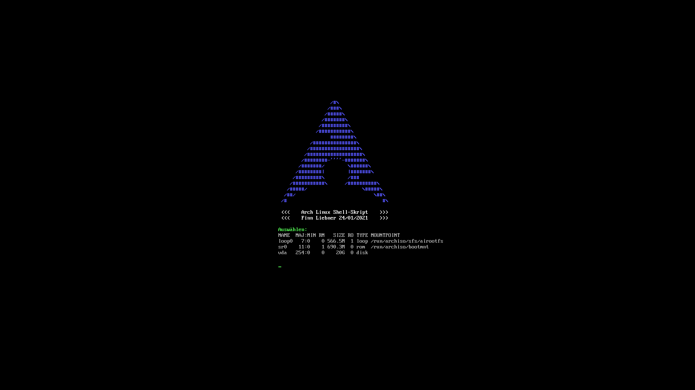
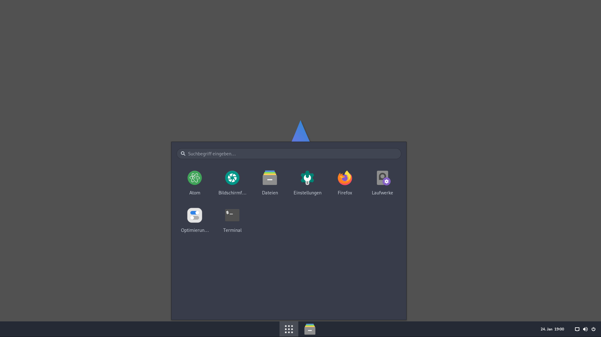
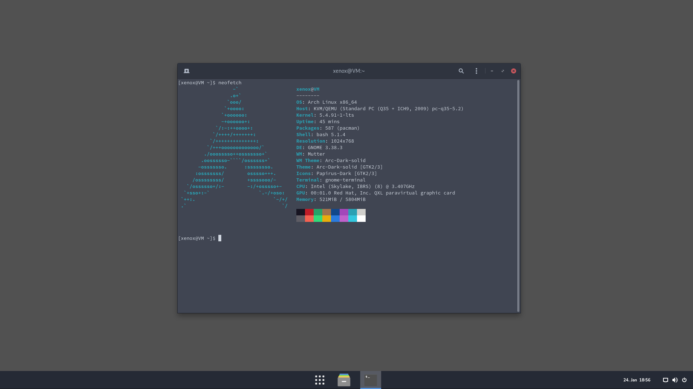

<h1 align="center">
  Installation of <a href="https://wiki.archlinux.org/">Arch Linux</a> using archium script
</h1>

<br>

<p align="center">
  This script makes it simple to install Arch Linux. A minimal Gnome desktop with Arc Menu and Dash to Panel is installed.
</p>

<h2 align="center">
  Notes
</h2

>> ⚠️ This script was tested and used within QEMU. It has not been tested or adapted for use on real hardware yet!

> ⚠️ You can delete partitions with this script and thus lose data. Please use it carefully.

<h2 align="center">
  Usage
</h2

<p align="center">
  First you need the iso file for Arch Linux. You can download this from the Arch Linux website. Then load it and you will get a terminal. Then you can start the archium script with these commands:
</p>

```bash
loadkeys de-latin1
curl https://raw.githubusercontent.com/finn-liebner/archium/master/main.sh -o a
chmod +x a
sh a
```

 

 
